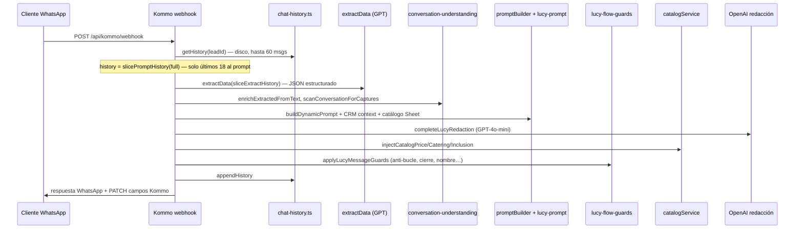

# Lucy (Bodasesor) — Paquete de código para revisión

Carpeta autocontenida con el **núcleo** de Lucy para mandar a Claude (u otro LLM) y que encuentre bugs de repetición, olvido de datos, menú hardcodeado, etc.

**Repo:** Agente_Virtual_Kommo · **Producción:** `https://midnightblue-mosquito-424375.hostingersite.com`

---

## Qué es Lucy

Agente virtual de WhatsApp/Kommo para Bodasesor (catering y eventos). Califica leads: nombre, correo, tipo de evento, servicios, invitados, lugar, fecha, presupuesto → cierre → pasa a asesor humano.

---

## Flujo de un mensaje (Kommo real)



**Simulador:** mismo pipeline en `POST /api/kommo/simulator` (sin Kommo real).

---

## Archivos más importantes (leer primero)

| Prioridad | Archivo | Qué hace |
|-----------|---------|----------|
| 1 | `src/routes/kommo.ts` | **Orquestador principal** (~2800 líneas): webhook, simulador, extractData, buildCrmContext, PATCH Kommo |
| 2 | `src/lucy-flow-guards.ts` | Post-procesado: anti-repetición, cierre, menú, presupuesto, nombre primero |
| 3 | `src/conversation-understanding.ts` | Parsing regex + captura contextual (respuestas cortas) |
| 4 | `src/lucy-prompt.ts` | System prompt base V7 |
| 5 | `src/services/promptBuilder.ts` | Prompt dinámico por etapa/score |
| 6 | `src/services/catalogService.ts` | Catálogo Google Sheets + inyección de precios/menú |
| 7 | `src/chat-history.ts` + `src/lib/lucyHistoryConfig.ts` | Memoria: guardado vs ventana al prompt |
| 8 | `src/services/lucyRedaction.ts` | Llamada GPT redacción + briefing |
| 9 | `src/types.ts` | ExtractedData y tipos CRM |

---

## Síntomas reportados (buscar en el código)

1. **Repite bloques de texto / menú** → `lucy-flow-guards.ts`, `catalogService.injectCatalogCateringIfAsked`, `buildFoodSalesReply`
2. **Olvida datos ya dados** → ventana `slicePromptHistory` (era 6, ahora 18), `extractData`, `buildCrmContext`, re-pregunta en guards
3. **No captura del primer mensaje largo** → `extractData`, `enrichExtractedFromText`, `scanConversationForCaptures`
4. **Precio esquivado** → `injectCatalogPriceIfAsked`, `price-guard.ts`
5. **Reinicia tras cierre** → `detectCierreEnviado`, `applyLucyMessageGuards`, post-cierre en guards
6. **Menú hardcodeado ignorando Sheet** → fix reciente en `catalogService.ts` (verificar que no haya otro interceptador)

---

## Memoria de chat (configurable)

Variables de entorno:

```
LUCY_PROMPT_HISTORY_MESSAGES=18   # user+assistant que ve GPT al redactar
LUCY_STORED_HISTORY_MESSAGES=60   # máximo en chat-history.json
LUCY_EXTRACT_HISTORY_MESSAGES=40  # ventana para extractor JSON
LUCY_SCAN_USER_MESSAGES=20        # escaneo pasivo de mensajes usuario
```

Ver valores activos: `GET /api/health` → campo `lucy_history`.

---

## Preguntas útiles para Claude

1. ¿Hay rutas donde `history` (corto) se usa en lugar de `fullHistory` para extracción o CRM?
2. ¿Los guards pueden volver a preguntar un campo ya en `filledLabels` o en `crmLines`?
3. ¿`injectCatalog*` reemplaza la respuesta del LLM y causa repetición?
4. ¿Race condition entre PATCH Kommo y `lastResponseCache`?
5. ¿El simulador y el webhook comparten la misma lógica o hay divergencias?

---

## Cómo usar este paquete

1. Sube la carpeta `lucy-core-export/` completa a Claude (Projects o zip).
2. Pega este `LEEME.md` como contexto inicial.
3. Opcional: adjunta un transcript fallido del simulador (cliente auto Sofía/Jorge).

---

## Fuera de este paquete (no incluido)

- UI simulador: `api-server/public/simulador/`
- Admin entrenamiento, aprendizaje, auth panel
- Tests: `api-server/src/selftest/lucy-flow-selftest.ts` (correr con `pnpm run selftest`)

---

## Generado

- Fecha: 2026-07-11
- Commit sugerido: rama `cursor/lucy-history-memory-6f2e` / `main`
- Archivos: ver `MANIFEST.txt`
